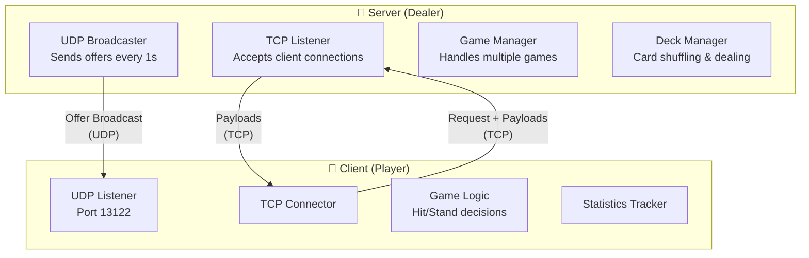
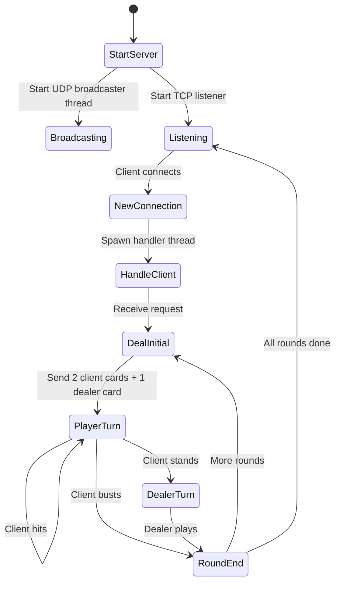
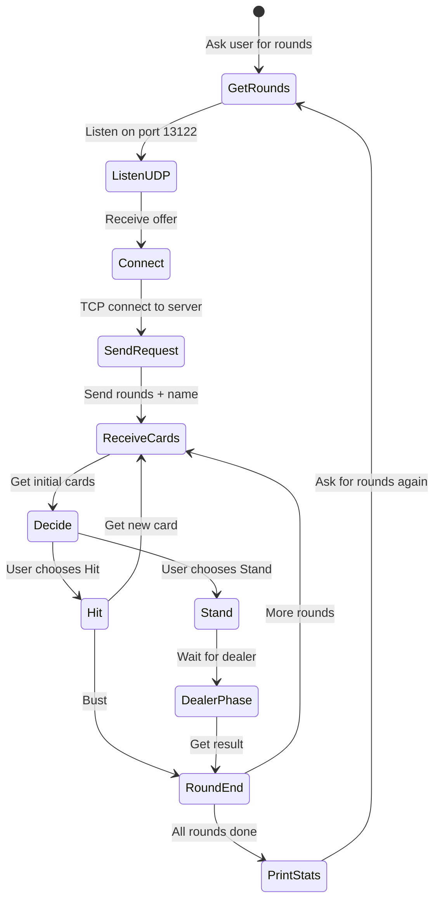
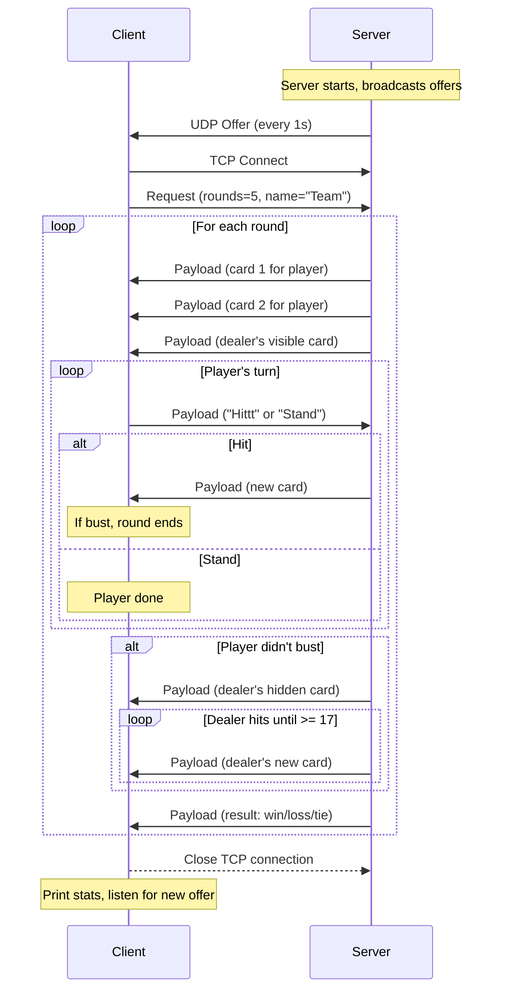

# Blackjack Network Application 

## Overview

This project implements a **networked Blackjack game** ("Blackijecky") for the Intro to Computer Networks 2025 Hackathon. The system consists of a **Server** (dealer) and **Client** (player) that communicate using UDP for discovery and TCP for gameplay.

---

## System Architecture



---

## Packet Formats

### 1. Offer Message (Server → Client, UDP Broadcast)

| Field | Size | Description |
|-------|------|-------------|
| Magic Cookie | 4 bytes | `0xabcddcba` |
| Message Type | 1 byte | `0x02` (offer) |
| TCP Port | 2 bytes | Server's TCP port |
| Server Name | 32 bytes | Padded/truncated team name |

**Total: 39 bytes**

---

### 2. Request Message (Client → Server, TCP)

| Field | Size | Description |
|-------|------|-------------|
| Magic Cookie | 4 bytes | `0xabcddcba` |
| Message Type | 1 byte | `0x03` (request) |
| Number of Rounds | 1 byte | 1-255 rounds |
| Client Name | 32 bytes | Padded/truncated team name |

**Total: 38 bytes**

---

### 3. Payload Message (Both Directions, TCP)

#### Client → Server:

| Field | Size | Description |
|-------|------|-------------|
| Magic Cookie | 4 bytes | `0xabcddcba` |
| Message Type | 1 byte | `0x04` (payload) |
| Decision | 5 bytes | `"Hittt"` or `"Stand"` |

**Total: 10 bytes**

#### Server → Client:

| Field | Size | Description |
|-------|------|-------------|
| Magic Cookie | 4 bytes | `0xabcddcba` |
| Message Type | 1 byte | `0x04` (payload) |
| Round Result | 1 byte | `0x00`=ongoing, `0x01`=tie, `0x02`=loss, `0x03`=win |
| Card Rank | 2 bytes | `01-13` (Ace=1, J=11, Q=12, K=13) |
| Card Suit | 1 byte | `0`=Heart, `1`=Diamond, `2`=Club, `3`=Spade |

**Total: 9 bytes**

---

## File Structure

```
hackaton/
├── server.py           # Main server application
├── client.py           # Main client application
├── protocol.py         # Packet encoding/decoding utilities
├── game_logic.py       # Blackjack rules, deck management & odds calculator
├── config.py           # Constants and configuration
└── utils.py            # Helper functions (display, logging)
```

---

## Module Details

### `config.py` - Constants

```python
MAGIC_COOKIE = 0xabcddcba
MSG_TYPE_OFFER = 0x02
MSG_TYPE_REQUEST = 0x03
MSG_TYPE_PAYLOAD = 0x04

UDP_BROADCAST_PORT = 13122
BROADCAST_INTERVAL = 1.0  # seconds

RESULT_ONGOING = 0x00
RESULT_TIE = 0x01
RESULT_LOSS = 0x02
RESULT_WIN = 0x03

SERVER_NAME = "YourServerName"  # Name broadcast by your server
CLIENT_NAME = "YourClientName"  # Name sent when your client connects
```

---

### `protocol.py` - Packet Handling

| Function | Description |
|----------|-------------|
| `pack_offer(tcp_port, server_name)` | Create offer packet |
| `unpack_offer(data)` | Parse offer packet → (tcp_port, server_name) |
| `pack_request(num_rounds, client_name)` | Create request packet |
| `unpack_request(data)` | Parse request packet → (num_rounds, client_name) |
| `pack_client_payload(decision)` | Create client payload ("Hittt" or "Stand") |
| `pack_server_payload(result, rank, suit)` | Create server payload with card |
| `unpack_client_payload(data)` | Parse client decision |
| `unpack_server_payload(data)` | Parse server response → (result, rank, suit) |

---

### `game_logic.py` - Blackjack Rules & Odds Calculator

| Class/Function | Description |
|----------------|-------------|
| **Card & Deck** | |
| `Card(rank, suit)` | Represents a card with rank (1-13) and suit (0-3) |
| `Deck` | 52-card deck with shuffle and deal methods |
| `calculate_hand_value(cards)` | Sum card values (Ace=11, Face=10) |
| `card_value(rank)` | Convert rank to point value |
| `format_card(rank, suit)` | Pretty print card (e.g., "A♠", "K♥") |
| **Odds Calculator** 🎲 | |
| `calculate_odds_if_hit(player_total, dealer_visible, known_cards)` | Returns (win%, lose%, tie%) if player Hits |
| `calculate_odds_if_stand(player_total, dealer_visible, known_cards)` | Returns (win%, lose%, tie%) if player Stands |
| `get_recommendation(player_total, dealer_visible, known_cards)` | Returns best decision with odds comparison |

**Example Client Output:**
```
╔═══════════════════════════════════════════════════════════════╗
║  Your hand: 10♥ 5♦  (Total: 15)                              ║
║  Dealer shows: 7♠                                             ║
╠═══════════════════════════════════════════════════════════════╣
║  📊 ODDS CALCULATOR                                           ║
║                                                               ║
║  If you HIT:                                                  ║
║    Win: 38%  |  Lose: 54%  |  Tie: 8%   = 100%               ║
║                                                               ║
║  If you STAND:                                                ║
║    Win: 26%  |  Lose: 66%  |  Tie: 8%   = 100%               ║
║                                                               ║
║  💡 Recommendation: HIT (+12% win chance)                     ║
╚═══════════════════════════════════════════════════════════════╝
```

**Calculation Method:**
- Track known cards (player's hand + dealer's visible card)
- Calculate remaining deck composition (52 - known cards)
- For **Stand**: Simulate all possible dealer outcomes (dealer must hit until 17+)
- For **Hit**: For each possible next card, calculate new hand value then simulate dealer
- All outcomes are Win/Lose/Tie, always summing to **100%**

---

### `server.py` - Server Application



**Key Features:**
- Multi-threaded: Each client connection handled in separate thread
- UDP broadcaster runs in background thread
- Fresh shuffled deck per round
- Proper cleanup on client disconnect

---

### `client.py` - Client Application



**Key Features:**
- Auto-reconnects after finishing rounds
- Tracks win/loss/tie statistics
- Colorful console output
- Timeout handling for network issues

---

## Game Flow Sequence



---

## Error Handling Strategy

| Scenario | Handling |
|----------|----------|
| Invalid magic cookie | Reject packet, log warning |
| Client disconnect mid-game | Clean up resources, log info |
| Server not responding | Timeout (5s), return to listening |
| Corrupted packet | Validate length before unpacking |
| Multiple clients same UDP port | Use `SO_REUSEADDR` |
| Network timeout | Implement socket timeouts |

---

## User Review Required

> [!IMPORTANT]
> **Team Names**: Please choose creative names for:
> - **SERVER_NAME**: Displayed when your server broadcasts offers
> - **CLIENT_NAME**: Sent when your client connects to any server
> 
> (They can be the same or different!)

> [!NOTE]
> **Client Strategy**: The current plan implements a simple interactive client where the user decides Hit/Stand. Do you want me to also implement an **auto-play mode** with a basic strategy (e.g., hit on 16 or below)?

---

## Implementation Order

1. **Phase 1**: `config.py` + `protocol.py` (packet formats)
2. **Phase 2**: `game_logic.py` (cards, deck, value calculation)
3. **Phase 3**: `server.py` (UDP broadcast + TCP game handling)
4. **Phase 4**: `client.py` (discovery + gameplay + statistics)
5. **Phase 5**: Testing & Polish (error handling, colorful output)

---

## Verification Plan

### Automated Tests
- Run server and client on same machine (localhost)
- Test with multiple simultaneous client connections
- Verify packet encoding/decoding with unit tests

### Manual Testing
- Test on phone hotspot network
- Verify interoperability with other teams' implementations
- Test error scenarios (disconnect mid-game, timeouts)
